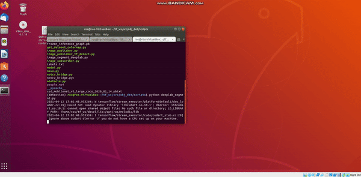

# Simple-Tf-ObjectDetection-SemanticSegmentation-ROS

## Dependencies

Create a virtual environment<br/>
```virtualenv --system-site-packages detection -p python3 ```<br/>
Activate the environment <br/>
``` source detection/bin/activate ``` <br/>
Install opencv <br/>
```  pip install opencv-contrib-python ```<br/>
``` pip install tensorflow ``` <br/>


Create workspace<br/>
```mkdir tf_ws```<br/>
```cd tf_ws/```<br/>
```mkdir src```<br/>
```catkin_make```<br/>
``` source devel/setup.bash```<br/>
```cd src/```<br/>

Create package<br/>
```catkin_create_pkg obj_det rospy roscpp std_msgs geometry_msgs sensor_msgs cv_bridge image_transport```<br/>


## Object Detection


Go inside obj_det and create a scripts folder and inside scripts folder paste all the files in my repo<br/>
Make sure to source everytime you open a new terminal <br/>
Now open new terminal and type<br/>
```roscore```<br/>

In the previous terminal<br/>
```python image_publisher_tf_detect.py``` <br/>

In another new terminal<br/>
```python image_subscriber_tf.py``` <br/>


## Semantic Segmentation

In one terminal <br/>
```roscore ``` <br/>

In another, <br/>
``` python basic_pub.py``` <br/>

Finally in a new terminal, <br/>
``` python deeplab_segment.py``` <br/>


## Output Object Detection & Semantic Segmentation


<p align="left">
  
</p>


<p align="left">
  
</p>


